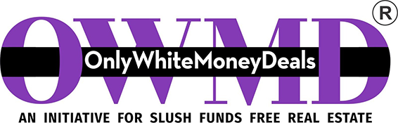

<div align="center">
  
  <h1>Only White Money Deals — OWMD</h1>
  <p><strong>India's First Exclusively White Money Real Estate Brokerage</strong></p>

  [](https://onlywhitemoneydeals.com)
  [](https://wa.me/919910805491)
  [](https://www.linkedin.com/company/only-white-money-deals/)
</div>

---

## 📖 About

**Only White Money Deals (OWMD)** is a purpose-driven real estate brokerage platform committed to 100% transparent, above-board property transactions — with **zero black money**, zero undisclosed cash, and full market value registration on every deal.

Founded by **Er. Bhupendra Pratap Singh, MRICS** — a Government Registered Valuer with 40+ years of real estate valuation experience and winner of the UP Government MSME 1st Prize (2018–19) — OWMD serves buyers, sellers, and NRIs seeking clean, legally sound property transactions in the Delhi NCR region.

> *"Honestly Earned, Tax-Paid Money Deserves Honest Deals"*

---

## 🏘️ Areas Served

Indirapuram · Vasundhara · Kaushambi · Vaishali · Siddharth Vihar · Crossing Republik · Raj Nagar Extension · **Noida** · **Greater Noida** · Noida Extension · Yamuna Expressway

---

## 🌐 Site Pages

| Page | Description |
|------|-------------|
| [`index.html`](index.html) | Homepage — hero, founder profile, benefits, how it works, NRI section, ethics, contact |
| [`browse-properties.html`](browse-properties.html) | Browse available properties with filters |
| [`list-property.html`](list-property.html) | Seller form — list a property for white money sale |
| [`benefits.html`](benefits.html) | Deep-dive into the financial & legal benefits of white money deals |
| [`faq.html`](faq.html) | Frequently asked questions |
| [`admin.html`](admin.html) | Internal admin panel (restricted) |
| [`owmd-team-portal.html`](owmd-team-portal.html) | Internal team portal (restricted) |

---

## 🛠️ Tech Stack

- **HTML5** — semantic, SEO-optimised markup
- **Vanilla CSS** — custom design system with CSS variables, glassmorphism, animations
- **Vanilla JavaScript** — no frameworks, fast and lightweight
- **Google Fonts** — Playfair Display (headings) & Inter (body)
- **Google Analytics** — GA4 tracking (`G-G6ZWSPKTQS`)
- **Schema.org** — structured data for `RealEstateAgent`, `Person`, `Service`

---

## 📁 Project Structure

```
owmd-site/
├── index.html              # Homepage
├── browse-properties.html  # Property listings
├── list-property.html      # Seller submission form
├── benefits.html           # White money benefits
├── faq.html                # FAQ page
├── admin.html              # Admin panel
├── owmd-team-portal.html   # Team portal
├── style.css               # Main stylesheet (source)
├── style.min.css           # Minified stylesheet (production)
├── script.js               # Main JS (source)
├── script.min.js           # Minified JS (production)
├── loader.js               # Page loader utility
├── sitemap.xml             # XML sitemap
├── robots.txt              # Search engine directives
├── _headers                # HTTP response headers (Cloudflare/Netlify)
├── minify_assets.py        # Build script to minify CSS/JS
├── partials/
│   ├── navbar.html         # Shared navigation bar
│   └── footer.html         # Shared footer
└── assets/
    ├── logo1.png
    ├── hero_bg.jpg
    ├── founder.jpg
    ├── award.jpg
    └── responsive/         # Responsive image variants (WebP/optimized)
```

---

## 🚀 Running Locally

No build step required — it's a static site. Just serve the files with any local server:

```bash
# Using Python
python3 -m http.server 8080

# Using Node.js (npx)
npx serve .

# Using VS Code Live Server extension
# Right-click index.html → "Open with Live Server"
```

Then open [http://localhost:8080](http://localhost:8080) in your browser.

---

## 🔧 Building / Minifying Assets

CSS and JS minification is handled by the included Python script:

```bash
python3 minify_assets.py
```

This generates `style.min.css` and `script.min.js` from their source files.

---

## 📞 Contact

| Channel | Details |
|---------|---------|
| 📱 Phone / WhatsApp | [+91 99108 05491](https://wa.me/919910805491) |
| 📧 Email | contact.us@onlywhitemoneydeals.com |
| 📍 Office | SA-17, First Floor, Opp. RR Cinema, Jaipuria Sunrise Plaza, Indirapuram, Ghaziabad, UP 201014 |
| 🌐 Website | [onlywhitemoneydeals.com](https://onlywhitemoneydeals.com) |

---

## 👤 Founder

**Er. Bhupendra Pratap Singh**
- 🏛️ MRICS (Member, Royal Institution of Chartered Surveyors)
- 📜 Government Registered Valuer — Income Tax Act, IBBI, Wealth Tax Act
- 🎓 MBA (Real Estate) · Visiting faculty at ICAI and public sector bank colleges
- 🏆 UP Government MSME 1st Prize Winner, 2018–19
- 📰 Featured in Hindustan Times, Indian Express, CNBC, Zee Business, Star News, Dainik Jagran

---

<div align="center">
  <sub>© 2024–2025 Only White Money Deals. All rights reserved.</sub>
</div>
